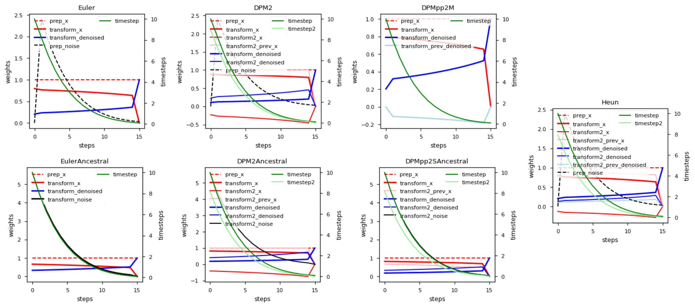

# Scheduler Hub

<!-- Can be lower -->
[](https://www.python.org/downloads/release/python-390/)
[](https://pytorch.org/)
[](https://opensource.org/licenses/MIT)

Scheduler Hub is a repository containing various schedulers for text-to-image diffusion models, with a focus on Stable-Diffusion. It supports different types of scheduler, it also support combining different scheduler and also the ability to train your own scheduler (WIP).

The goal of this project is to make it easier for users to experiment with different schedulers and compare their performance. The project includes an easy-to-use API that can be used to initialize and apply the different schedulers to diffusion models.

Overall, Scheduler Hub provides a simple and convenient way for researchers and developers to experiment with different schedulers for text-to-image models and improve the performance of their models.

# Installation

To install Scheduler Hub, simply clone this repository to your local machine:

```bash
pip install git+https://github.com/tfernd/scheduler-hub.git
```

# How to Use the Different Schedulers

Scheduler Hub provides several different schedulers that can be used to sample from the diffusion process of diffusion models. Here is a brief overview of how to use each of the schedulers:

Here is a list of schedulers currently implemented.
- [x] Euler
- [x] Euler-ancestral
- [x] Heun
- [x] DPM2 
- [x] DPM2-ancestral 
- [x] DPM++ 2m 
- [x] DPM++ 2s-ancestral
- [ ] DDIM (WIP)


A scheduler can be initialized by giving a list of sigmas using the `get_sigmas_karras` function, which takes as input the number of diffusion steps, the initial sigma, and the final sigma.

```python
import scheduler_hub as sh

sigmas = sh.get_sigmas_karras(steps, 0.1, 10)
scheduler = sh.Euler(sigmas)
```

Once you have created the scheduler, you can use the `sample` method to sample from the diffusion process. This method takes as input a diffusion model and a batch of latents vectors, and returns a batch of denoised vectors. For example:

```python
import torch

model = ... # initialize your text-to-image model
latents = torch.randn(1, 4, 32, 32) # create a batch of latents

denoised = scheduler.sample(model, latents)
```

In addition to using the `sample` method to apply a scheduler, you can also use the same notation as in k-diffusion and call a scheduler using the `sample_scheduler` method. For example, you can call the Euler scheduler using `sample_euler`. This method uses the same layout as k-diffusion but leverages the Scheduler Hub API for the call. This can provide a familiar syntax for users who are already familiar with the k-diffusion framework and make it easier to integrate Scheduler Hub into their workflows.

# Visualizing different schedulers

All schedulers mentioned before are visualized here. The prefix `prep` refers to the weight that is multiplied prior to evaluating the model, while the prefixes `transform` and `transform2` refer to the weights after evaluating the model. The number 2 is used for second-order methods that evaluate the model twice in a single step. The prefix `prev` is used for models that have memory of previous steps. The boolean `order_mask` determines whether the second-order method will evaluate the second iteration or not. The suffixes `x`, `noise`, and `denoised` refer to the weights for the latents, noise, and the model output.

Different schedulers can be visualized using the `plot` method of each scheduler object. 




# Project Status

Scheduler Hub is currently in active development and is being actively maintained. We are currently working on adding support for training schedulers based on an initial image, which will allow users to train custom schedulers for Stable-Diffusion.

Our goal is to make Scheduler Hub as useful as possible for researchers and developers in the field of text-to-image generation. We welcome contributions from the community, and are committed to addressing any issues or limitations of the project that users may encounter.

If you encounter any issues with Scheduler Hub or have any suggestions for future development, please don't hesitate to submit an issue or pull request on GitHub. We encourage collaboration and contributions from the community, and will do our best to respond to any feedback or suggestions in a timely manner.

# License

This project is licensed under the MIT License. See the LICENSE file for more information.